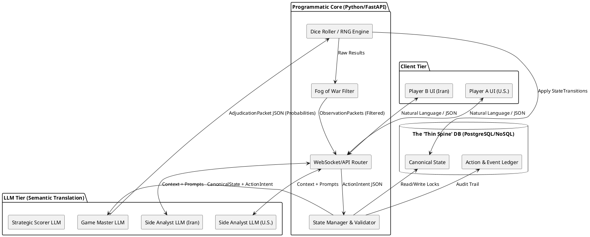
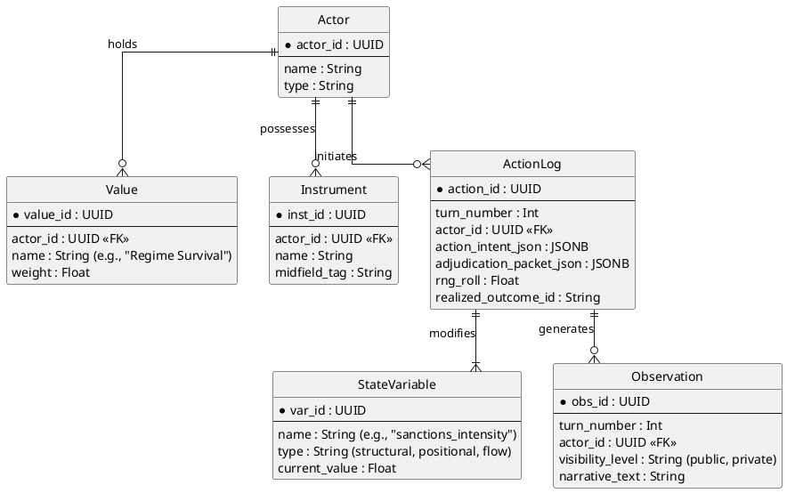
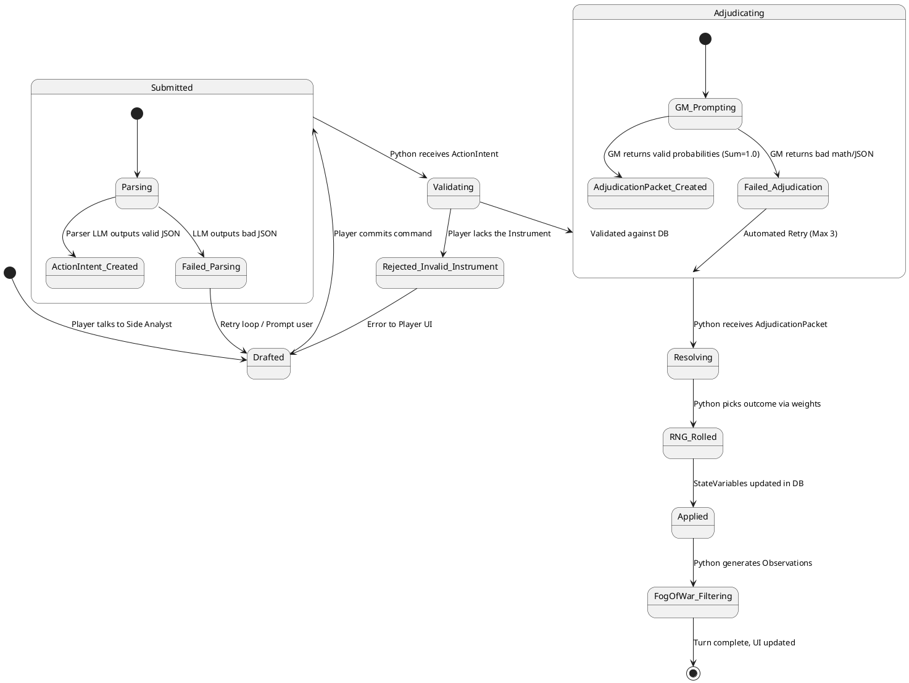
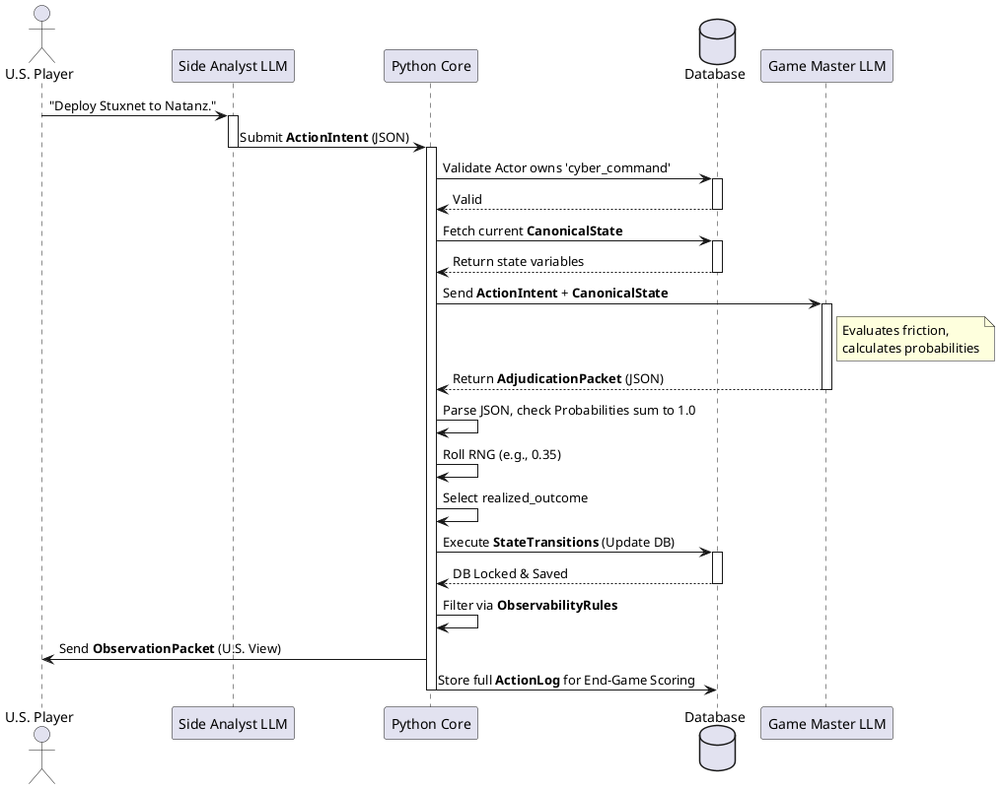

Here is the ASCII diagram mapping out the full hybrid architecture. 

It explicitly separates the **"LLM Brains"** (handling natural language, psychology, and probability estimation) from the **"Programmatic Spine"** (handling the rigid database, math, and random number generation).

```text
=========================================================================
 1. THE PRINCIPALS (Human/NL Layer)
=========================================================================
    [ Player A (e.g., U.S.) ]                 [ Player B (e.g., Iran) ]
           |      ^                                  |      ^
      (NL  |      | (NL Briefings)              (NL  |      | (NL Briefings)
    Orders)|      |                           Orders)|      |
           v      |                                  v      |
      +---------------+                         +---------------+
      | Side LLM A    |                         | Side LLM B    |
      | (Intel/Parser)|                         | (Intel/Parser)|
      +---------------+                         +---------------+
           |                                         |
           | [ActionIntent JSON]                     | [ActionIntent JSON]
           v                                         v
=========================================================================
 2. THE THIN SPINE (Python Core - Source of Truth)
=========================================================================
           +-------------------------------------------------+
           | ACTION ROUTER & STATE DATABASE                  |
           | - Validates Actor owns the Instruments used     |
           | - Holds CanonicalState (Values, Variables)      | <----+
           +-------------------------------------------------+      |
                           |                                        |
                           | (ActionIntent + Current State)         |
                           v                                        |
=========================================================================
 3. THE ADJUDICATION ENGINE (Game Master LLM)                       |
=========================================================================
           +-------------------------------------------------+      |
           | GAME MASTER LLM                                 |      |
           | - Reads intent & limits via Interaction Model   |      |
           | - NO GOD-MODING (strictly evaluates friction)   |      |
           | - Generates outcome distribution (Sum = 1.0)    |      |
           +-------------------------------------------------+      |
                           |                                        |
                           | [AdjudicationPacket JSON]              |
                           v                                        |
=========================================================================
 4. THE RESOLUTION ENGINE (Python Core)                             |
=========================================================================
           +-------------------------------------------------+      |
           | DICE ROLLER & STATE UPDATER                     |      |
           | 1. RNG execution (Python random.choices)        |      |
           | 2. Applies StateTransitions to Database --------|------+
           | 3. Enforces Observability Rules (Fog of War)    |
           +-------------------------------------------------+
                 |                                  |
                 | [ObservationPacket JSON]         | [ObservationPacket JSON]
                 v                                  v
      (Routes visible data back to Side LLMs for the next turn)

=========================================================================
 5. END OF GAME SCORING (Strategic Expert LLM)
=========================================================================
           +-------------------------------------------------+
           | EVALUATOR LLM                                   |
           | - Reads final CanonicalState vs Initial Values  |
           | - Scores asymmetric value realization           |
           +-------------------------------------------------+
```

### **Why this layout protects your game:**
1. **Total Isolation of Imagination vs. Math:** The Game Master LLM *never* touches the database. It is simply a very smart function that converts a state and an action into a probability table. Python does the actual math and state updates.
2. **True Fog of War:** The GM LLM outputs the truth of what happened alongside rules for who can see it. Python physically strips the hidden data out before sending the `ObservationPacket` back up to the Side LLMs, making it impossible for the Side LLMs to accidentally leak enemy secrets to the players.
3. **The Parser Funnel:** Because the Side LLMs are forced to output the rigid `ActionIntent JSON` to interact with the engine, players can type whatever wildly creative prose they want, but the system won't progress until the LLM successfully maps it to your established causal grammar.


Here is the complete blueprint for your system. I have ordered these from the highest level of abstraction (the entire system) down to the lowest (the exact API call sequence). 

I am providing these using **PlantUML syntax**. You can copy and paste these code blocks directly into any PlantUML viewer (like PlantText.com or the PlantUML VS Code extension) to instantly generate the visual diagrams.

### **1. Component / Architecture Diagram (The 10,000-Foot View)**
**Why first:** Before we map the data, we need to establish the hard boundaries. This diagram ensures that the Side LLMs (the players' intelligence chiefs) are physically isolated from the Canonical Database to prevent cheating or "God Moding."



---

### **2. Entity-Relationship Diagram (The "Thin Spine" Data Schema)**
**Why second:** Now that we know where the data lives, we define what it looks like. This represents the absolute minimum relational structure needed to persist the game. Notice there are no "Objectives" or "Constraints" tables—those are derived dynamically by the LLM from the `StateVariable` table.



---

### **3. UML State Machine Diagram (The Action Lifecycle)**
**Why third:** This maps the lifecycle of a single move. It is critical for engineering because it highlights the failure states (e.g., what happens if the GM LLM hallucinates bad JSON).



---

### **4. UML Sequence Diagram (The Turn Resolution Flow)**
**Why last:** This is the exact step-by-step API call chain. If you hand this to a backend engineer, they can build the FastAPIs and WebSockets directly from this flow. 



### **What's Next?**
These diagrams lock in the engineering architecture. We have successfully bridged the abstract geopolitical theory with a rigid software design. 

Would you like me to start translating these diagrams into the actual **Python Pydantic models (Data Classes)** or the **FastAPI routing logic** that will run the programmatic core?
